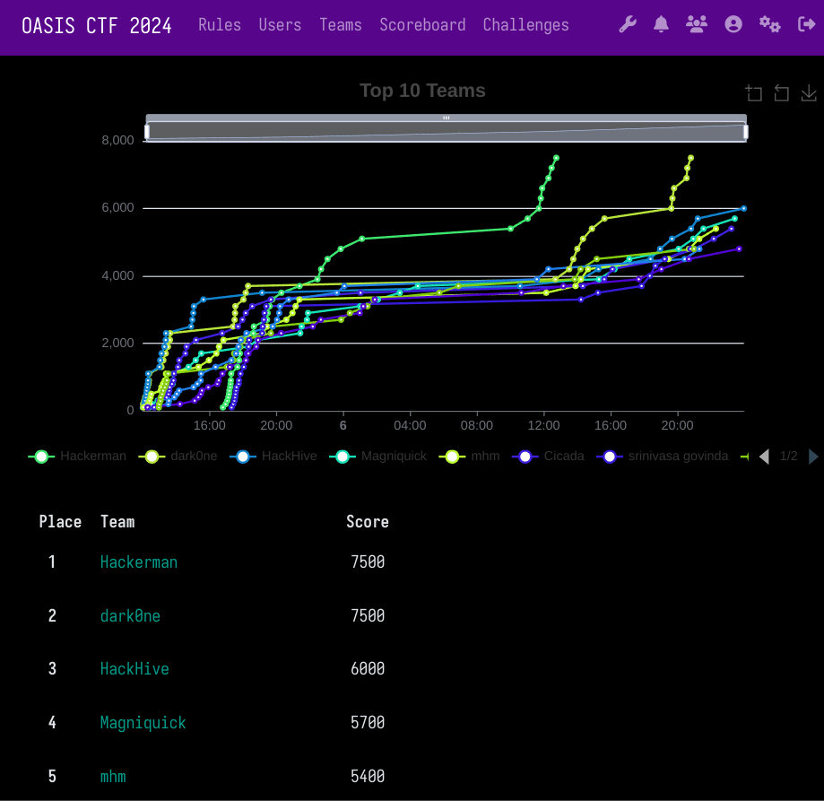
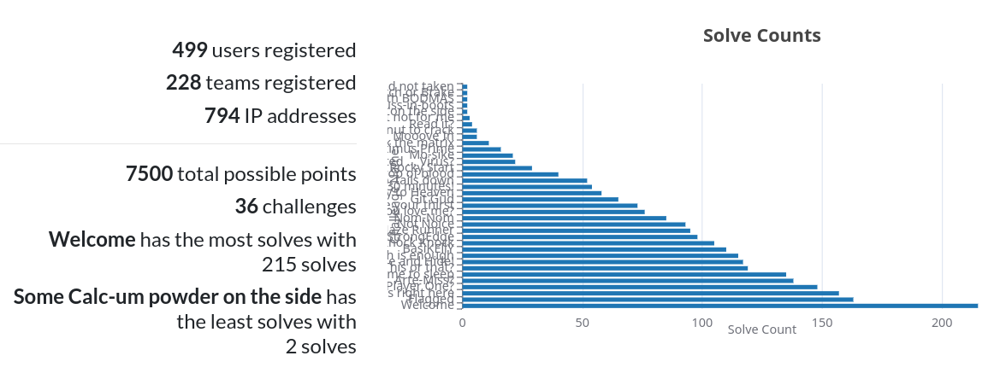
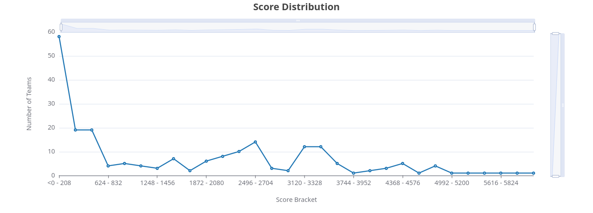

# oasisCTF 2024

oasisCTF 2024 was a 36-hour jeopardy-style Capture the Flag (CTF) event held exclusively for Manipal Academy of Higher Education (MAHE) students. It was conducted in online mode on 5 and 6 October 2024 as part of Cryptober 2024.

This repository contains official source code and writeups for challenges from oasisCTF 2024.

## Statistics

